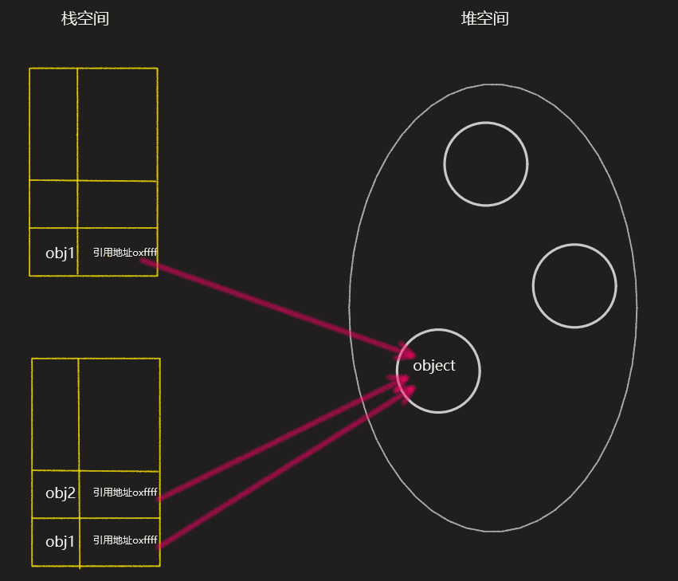
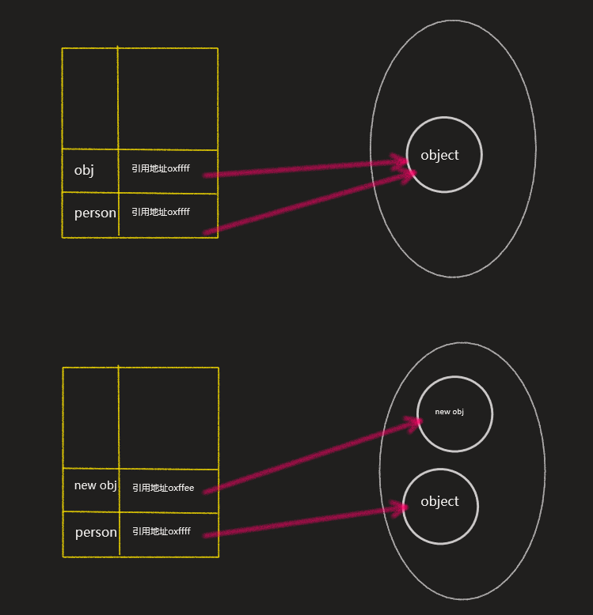

# 值类型

## 基本类型值和引用类型值

**定义**

1. 基本类型值是简单的数据段，基本类型值储存在栈中。

2. 引用类型值时由多个值构成的对象，引用类型值储存在堆中，但是对象的引用储存在栈中。

   **在操作对象时，复制或保存某个变量，操作的是对象的引用；为对象添加属性时，操作的是实际对象的值。**

## 关于动态属性

1. 引用类型值：可以对其属性和方法进行增、删、改。

```javascript
var person = new Object()
person.name = "Lei"

console.log(person.name) // "Lei"

person.name = "Le"
console.log(person.name) // "Le"

delete person.name
console.log(person.name) // undefined
```

2. 基本类型值：尽管可以为基本类型值添加属性，不会报错。但是这个属性实际上是添加不上的。

```javascript
var name = "Lei"
name.age = 19

console.log(name.age) // undefined
```

## 关于复制变量

1. 基本类型值

基本类型值得复制，实际上是创建一个新值，并把值分配给新的变量。

对复制后的两个变量操作，不会互相影响。

```javascript
var num1 = 5
var num2 = num1
console.log(num2) // 5
num2 = 3
console.log(num1) // 5
```

**栈空间（复制前）**

|      |      |
| :--: | :--: |
|      |      |
| num1 |  5   |

**栈空间（复制后）**

|      |      |
| :--: | :--: |
| num2 |  5   |
| num1 |  5   |

2. 引用类型值

引用类型值复制，其实是复制的对象的引用。

```javascript
var obj1 = {
	name: 'Lei'
}
var obj2 = obj1
console.log(obj2.name) // "Lei"
```



## 关于传递参数

1. 基本类型值：按照值传递很好理解，就和复制变量一样。

2. 引用类型值：向函数传递引用类型值得时候，会把对象的引用地址传递给命名参数，因此也说引用类型值的参数也是按值传递的。

   所以引用类型值传递参数，会有以下特点

```javascript
function setName(obj){
	obj.name = "Lei"
}
var person = new Object()
setName(person)
console.log(person.name) // "Lei"
```

**因为对象obj和person引用地址一样，所以引用的是同一个对象，对obj的操作会反映到person上。**

```javascript
function setName(obj){
	obj.name = "Lei"
	obj = new Object()
	obj.name = "Le"
}
var person = new Object()
setName(person)
console.log(person.name) // "Lei"
```

**由于在内部重写了obj对象，obj的引用地址已经发生了变化，所以再对obj.name赋值，实际上并不是修改的person。** 



